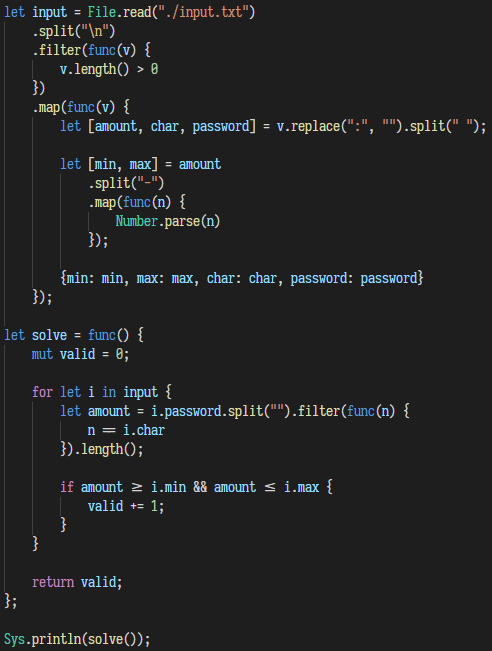

# Snekky Language
This extension provides support for the Snekky programming language.

## Features

- Syntax Highlighting

## Installation
1. Download the latest release from the [releases tab](https://github.com/snekkylang/snekky-vscode/releases).
2. Install it using `code --install-extension <file>.vsix`.
3. Restart VS Code.

## Release Notes

### 0.0.1
- Initial release

### 0.2.0
- Added support for new keywords.
- Fixed first parenthesis of calls being yellow.

### 0.3.0
- Added support for `in` keyword

### 0.3.1
- Fixed closures not being highlighted

### 0.4.0
_ Added support for custom regex syntax
